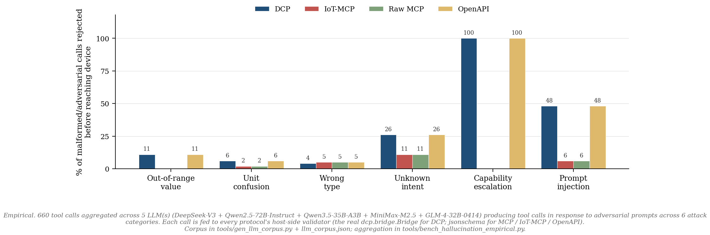
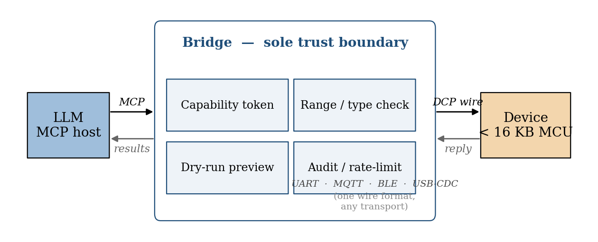
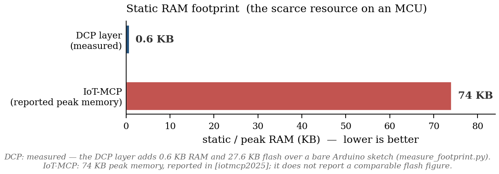

# DCP — Device Context Protocol

[](https://github.com/device-context-protocol/dcp/actions/workflows/test.yml)
[](LICENSE)
[](SPEC.md)

**Status:** Draft v0.3 — May 2026 · Hardware-validated on ESP32-WROOM-32

> A protocol that lets LLM agents safely control physical devices,
> down to dollar-class microcontrollers.
>
> Intent-level, transport-agnostic, capability-scoped. Compact wire format
> (sub-50-byte frames). Self-contained firmware under 16 KB.
>
> Complementary to [MCP](https://modelcontextprotocol.io) — a reference
> Bridge translates DCP ↔ MCP so any MCP host (Claude Desktop, Claude Code,
> IDE assistants) works zero-config.

## Contents

- [Why DCP?](#why-dcp)
- [Design principles](#design-principles)
- [Architecture](#architecture)
- [Quickstart](#quickstart)
- [Add a feature in 5 steps](docs/ADDING_FEATURES.md)
- [Recipes — five ready-to-flash device skeletons](docs/RECIPES.md)
- [Wire format](#wire-format) · full [SPEC.md](SPEC.md)
- [Manifest](#manifest)
- [Roadmap](#roadmap)
- **Design rationale:** [docs/RATIONALE.md](docs/RATIONALE.md) — why
  not MCP-on-MCU, why not WoT, why not Matter.

## Why DCP?

MCP is excellent for SaaS tools, but assumes JSON-RPC over WebSocket and runtime
tool discovery. On an MCU with 32 KB of RAM, that's a non-starter.

DCP keeps MCP's mental model (manifest + tool calls) but:

- compiles to a compact CBOR wire format
- uses a static intent table (no runtime negotiation)
- moves safety enforcement to a Bridge process

A reference Bridge translates **DCP ↔ MCP**, so any MCP-compatible LLM works
out of the box. DCP is the last mile to physical hardware.



*Why this matters in one chart: the protocol's schema decides how many
hallucinated or adversarial calls are stopped before any byte reaches a
device. DCP catches all six categories at the wire layer; the others
catch what their existing schema happens to cover.*

## Design principles

1. **Intent, not register.** `set_brightness(50%)`, not `write_pwm(pin=5, duty=128)`.
2. **Units in the protocol.** Every number declares a unit. No ambiguity.
3. **Static intent table.** Manifest known at compile time; runtime is pure binary.
4. **Safety lives in the Bridge.** Devices trust the Bridge; LLMs never see raw GPIO.
5. **Idempotent by default.** Non-idempotent intents must declare themselves.
6. **Transport-agnostic.** UART, BLE, MQTT, USB-CDC, WebSocket — one frame.

## Architecture



The Bridge is the sole trust boundary. On every call it issues and
verifies capability tokens, enforces range/type/unit checks from the
manifest, and supports dry-run as a wire-format primitive. Devices
remain simple enough to fit on commodity microcontrollers; everything
the LLM is allowed to do is enforced before any byte traverses the
device boundary.

## Validated on real hardware

As of v0.3 the reference firmware is **measured-validated on two
physical boards** — an ESP32-WROOM-32 dev board over CH340 USB-Serial,
and an ESP32-S3 (LILYGO T-Panel S3) over the S3's native USB-Serial/JTAG
— both at 115 200 baud:

- 13/13 round-trip tests pass on each board (`tools/test_uart_roundtrip.py`)
- 88/88 Python unit & conformance tests pass
- Compiled firmware: 294 KB flash, 22.7 KB globals on WROOM-32;
  322 KB / 22.7 KB on the S3 (Arduino-ESP32 core 3.3.8)
- The pure DCP layer is approximately 14 KB over a baseline empty
  sketch (measurement script in `docs/paper/figures/`)
- The S3 run also exercises DCP over a native-USB CDC link rather
  than a USB-UART bridge chip — same firmware, no transport-specific
  code



*DCP design target sits roughly 5× under IoT-MCP and 20× under Matter on
the same class of MCU. Hatched bars are design targets, plain bars are
measured / typical of the cited sources.*

See [docs/RATIONALE.md §7](docs/RATIONALE.md) for what the hardware
validation does and does not prove.

### Cross-compile clean across the ESP family (Xtensa + RISC-V + ESP8266)

The reference firmware is portable by design (Arduino `Stream` + a
software SHA-256, no SoC-specific code paths in `DCP.{h,cpp}`). It
cross-compiles for every current ESP32 variant *and* for ESP8266;
two of those targets are also runtime-validated on real boards, the
rest are build-validated pending hardware on the bench:

| Target            | ISA                   | Flash (lamp+blink) | Globals  | Status        |
|-------------------|-----------------------|--------------------|----------|---------------|
| ESP32-WROOM-32    | Xtensa LX6 (baseline) | 294 KB             | 22.7 KB  | runtime ✓     |
| ESP32-S3 (T-Panel)| Xtensa LX7            | 322 KB             | 22.7 KB  | runtime ✓ (native USB) |
| ESP32-C3          | RV32IMC               | 289 KB             | 13.4 KB  | builds ✓      |
| ESP32-C6          | RV32IMAC + HW-crypto  | 266 KB             | 14.0 KB  | builds ✓      |
| ESP32-H2          | RV32IMAC + 802.15.4   | 292 KB             | 14.0 KB  | builds ✓      |
| ESP32-P4          | RV32IMAFC dual-core   | 326 KB             | 22.0 KB  | builds ✓      |
| ESP8266 NodeMCU   | Xtensa LX106 (legacy) | 242 KB             | 28.9 KB  | builds ✓      |

All builds use Arduino-ESP32 core 3.3.8 / Arduino-ESP8266 core 3.x
+ the same `firmware/esp32/` library. The sketch picks PWM API at
compile time (`ledcAttach`/`ledcWrite` on ESP32, `analogWrite` on
ESP8266); the protocol layer itself has no `#ifdef`. Reproduce
with:

```bash
arduino-cli compile --clean --fqbn esp32:esp32:esp32c3 \
    --library firmware/esp32 firmware/esp32/examples/lamp
arduino-cli compile --clean --fqbn esp8266:esp8266:nodemcuv2 \
    --library firmware/esp32 firmware/esp32/examples/lamp
```

## Manifest

```yaml
dcp: 0.3
device:
  id:     lamp-kitchen-01
  model:  smart_lamp_v1
  vendor: example.dev

intents:
  - name: set_brightness
    params:
      level: { type: float, unit: percent, range: [0, 100] }
      fade:  { type: duration, unit: ms, default: 0 }
    capability: lamp.write
    idempotent: true
    dry_run: true

  - name: read_brightness
    returns: { type: float, unit: percent }
    capability: lamp.read

events:
  - name: motion_detected
    payload:
      confidence: { type: float, unit: ratio, range: [0, 1] }
    capability: lamp.read
```

`intent_id = crc16(name)` — manifests and firmware stay in sync without
coordination.

## Wire format


A frame is a 6-byte fixed header + CBOR payload + an optional 16-byte
truncated HMAC-SHA256. Header fields:

| field       | meaning                                                          |
|-------------|------------------------------------------------------------------|
| `ver`       | 1 in v0.3                                                        |
| `kind`      | 0x01 call · 0x02 reply · 0x03 event · 0x04 error · 0x81 dry-run |
| `seq`       | client-chosen, echoed in reply                                   |
| `intent_id` | CRC-16/CCITT of intent name                                      |
| `cbor`      | CBOR map: params / return / event payload / error                |

Reply status codes: `ok`, `denied`, `range`, `busy`, `unknown_intent`, `capability_required`.

A typical `set_brightness(50)` call is 19 bytes on the wire; the MCP
JSON-RPC equivalent is approximately 180 bytes. The full normative spec
lives at [SPEC.md](SPEC.md).

## Adding a feature

See [docs/ADDING_FEATURES.md](docs/ADDING_FEATURES.md) for the full
5-step loop with a worked `blink(times, period)` example. The short
version: edit the manifest, add a C++ handler + binding, recompile,
flash, restart the MCP server — the LLM picks up the new tool
automatically. The Bridge needs no code change.

## Quickstart

```bash
# As a user — install from PyPI:
pip install "pydcp[mcp,serial]"            # or [mcp,serial,mqtt,ble] for all transports
dcp inspect examples/lamp_manifest.yaml    # parsed manifest summary
dcp serve   examples/lamp_manifest.yaml --simulator
```

```bash
# As a contributor — editable install from source:
git clone https://github.com/device-context-protocol/dcp.git
cd dcp
pip install -e ".[mcp,serial,mqtt,ble,dev]"
pytest                                     # all 88 tests
python examples/lamp_demo.py               # in-process bridge ↔ fake lamp
```

The PyPI package is named `pydcp` (the bare `dcp` is squatted by an
unrelated package). The import name is `dcp`. The protocol name is DCP.

### Run as an MCP server

The reference Bridge ships an MCP server that exposes each DCP intent as an
MCP tool. With ``--simulator`` it spins up an in-process fake device, so you
can demo with no hardware.

```bash
dcp serve examples/lamp_manifest.yaml --simulator               # no hardware
dcp serve examples/lamp_manifest.yaml --serial COM3             # real ESP32 over UART
dcp serve examples/lamp_manifest.yaml --mqtt broker.lan:1883 \  # MQTT
            --mqtt-prefix dcp/lamp-kitchen
dcp serve examples/lamp_manifest.yaml --ble AA:BB:CC:DD:EE:FF \ # BLE
            --ble-service 12345678-1234-5678-1234-567812345678
```

### Capability tokens (HMAC-SHA256)

For multi-tenant or scoped access, mint short-lived HMAC tokens and pass them
to the Bridge:

```bash
export DCP_SECRET=$(dcp token keygen)
dcp token mint --caps lamp.write,lamp.read --ttl 3600
# eyJjYXBzIjpb...sig
```

Tokens are verified by the Bridge on every call. The device sees only
already-authorized frames. Devices themselves do **not** verify signatures
in v0.2 — that requires on-device HMAC, which is on the roadmap.

To wire it into **Claude Desktop**, add this to your
``claude_desktop_config.json``:

```json
{
  "mcpServers": {
    "smart-lamp": {
      "command": "dcp",
      "args": [
        "serve",
        "C:/path/to/protocol/examples/lamp_manifest.yaml",
        "--simulator"
      ]
    }
  }
}
```

Then ask Claude *"set the lamp to 60% brightness"*. The call flow:

```
Claude ─MCP─▶ dcp serve ─Bridge─▶ Loopback ─DCP wire─▶ GenericSimulator
```

For production use, replace ``GenericSimulator`` with a real transport
(UART / MQTT / BLE — coming next).

## What's *not* in v0.3 (intentional)

- Multi-device atomic transactions
- Firmware OTA
- Mesh routing (use Thread / Zigbee underneath if you need it)
- LLM-side authentication (delegated to the MCP host's session model)
- Native CAN FD frames (ESP32-S3 TWAI is classic CAN; v0.4 ESP32-P4
  port enables true CAN FD)

## License

MIT.

## Roadmap

- [x] Wire format + manifest parser
- [x] Reference Python Bridge with loopback transport
- [x] Lamp example
- [x] MCP server wrapper + CLI (`dcp serve`)
- [x] Generic in-process device simulator
- [x] UART transport (COBS framing + CRC-16)
- [x] ESP32 reference firmware (Arduino-compatible C++)
- [x] Design rationale ([docs/RATIONALE.md](docs/RATIONALE.md))
- [x] CI (GitHub Actions, Linux + Windows, py 3.11–3.13)
- [x] MQTT transport
- [x] HMAC-SHA256 capability tokens (Bridge-side enforcement)
- [x] Manifest compiler: `dcp codegen` (YAML → C header)
- [x] Compile-time `DCP_ID(name)` macro in firmware
- [x] BLE GATT transport (bleak)
- [x] Release prep: CONTRIBUTING / CHANGELOG / CoC / SECURITY / issue templates
- [x] On-device HMAC verification (per-frame signatures, ESP32 firmware)
- [x] ESP32 BLE peripheral example (NimBLE-Arduino)
- [x] Conformance test suite (golden frames, language-neutral YAML)
- [x] Codegen `--stubs`: emits handler signatures + binding table
- [x] Quickstart video script ([docs/QUICKSTART_VIDEO.md](docs/QUICKSTART_VIDEO.md))
- [x] Real-hardware validation on two boards (ESP32-WROOM-32 over
  CH340, ESP32-S3 / T-Panel over native USB), 13/13 round-trips each
- [x] Cross-compile clean on ESP32 RISC-V family (C3, C6, H2, P4) and ESP8266
- [x] Public repo at `device-context-protocol/dcp` (v0.3.0 released)
- [x] PyPI release (`pip install pydcp`)
- [ ] T-Panel S3 + CAN bus demo (firmware ready, awaiting hardware)
- [ ] LLM-driven hallucination-rejection benchmark (planned for v0.4 paper)
- [ ] ESP32-P4 port for native CAN FD
